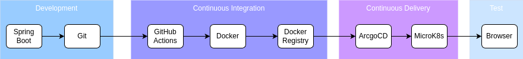

# CI/CD GitOps Demo
---


##  [**Video Lab Link:**](https://www.youtube.com/watch?v=JdMWLDY5UNM) Click this link to follow along with a video instruction.

---
## Introduction

- Let's dive into learning a CI/CD workflow with GitOps! I'm assuming you're a software developer with experience in Java, Git, Docker, and some DevOps tools—perfect for following along.
- The main focus of this demo is to show how lightweight, on-premise tools can create a cloud-native developer sandbox.
- We'll use tools like a local Docker Registry, MicroK8s Kubernetes, a GitHub self-hosted runner for CI, and ArgoCD on MicroK8s for CD—all streamlined and simple.
- Expect one Spring Boot microservice, one Kubernetes pod, all running on-premise with a "happy path" scenario.
- I'll walk you through step-by-step with code examples—everything's clear and functional.
- All steps are in my GitHub repo: [karmatech-us/my-gitops-demo](https://github.com/karmatech-us/my-gitops-demo).


---

## Objective
Build a simple CI/CD pipeline that:
- Develops a Spring Boot microservice with a single `/hello` endpoint.
- Uses GitHub as the code repository and GitHub Actions for CI.
- Builds and pushes a Docker image to an on-premise Docker registry.
- Deploys the image to a single-node MicroK8s cluster using ArgoCD for CD.
- Includes minimal Infrastructure as Code (IaC) and a basic endpoint test.

## Tools Used
- **GitHub**: Code repository.
- **GitHub Actions**: CI pipeline.
- **Docker**: Containerization and local registry.
- **Spring Boot (Java)**: Microservice framework.
- **MicroK8s**: Kubernetes distribution.
- **ArgoCD**: GitOps CD tool.


---


## Section 1: Environment Setup & Initial Spring Boot Code

### Step 1: Set Up Your Environment
Prepare your on-premise setup on an Ubuntu 22.04 VM.

- **Provision an Ubuntu 22.04 VM**
  - Using `libvirt/kvm` to create a VM with Ubuntu 22.04 Server.
  - Bash script for VM creation: [create_vm.sh](create_vm.sh) (available in the repo).

- **Install Maven**
  - For Spring Boot builds:
    ```bash
    sudo apt install maven -y
    ```

- **Install Zip and Unzip**
  - Utilities for file handling:
    ```bash
    sudo apt install zip unzip -y
    ```

- **Install SDKMAN**
  - To manage JDK versions:
    ```bash
    curl -s "https://get.sdkman.io" | bash
    source "$HOME/.sdkman/bin/sdkman-init.sh"
    sdk version
    ```

- **Install JDK**
  - JDK 21 via SDKMAN:
    ```bash
    sdk install java 21.0.6-tem
    ```

- **Install Docker**
  - Install Docker and set up the local registry:
    - Script: [docker_install.sh](docker_install.sh) (installs Docker and Compose).
    - Add user to Docker group:
      ```bash
      sudo usermod -aG docker $USER
      newgrp docker
      docker images
      ```

- **Install kubectl**
  - For Kubernetes interaction:
    - Script: [kubectl_install.sh](kubectl_install.sh).

- **Install MicroK8s**
  - Lightweight Kubernetes:
    ```bash
    sudo snap install microk8s --classic
    sudo usermod -aG microk8s $USER
    newgrp microk8s
    mkdir -p ~/.kube
    microk8s config > ~/.kube/config
    sudo chown -R $USER ~/.kube
    microk8s status --wait-ready
    microk8s enable dns
    ```
  - Alias `kubectl`:
    ```bash
    sudo snap alias microk8s.kubectl kubectl
    ```

- **Set Up Local Docker Registry**
  - Run on port 5000:
    ```bash
    docker run -d -p 5000:5000 --restart=always --name registry registry:2
    ```
  - Verify:
    ```bash
    docker ps
    curl http://localhost:5000/v2/_catalog
    ```

- **Install ArgoCD**
  - Deploy to MicroK8s:
    ```bash
    kubectl create namespace argocd
    kubectl apply -n argocd -f https://raw.githubusercontent.com/argoproj/argo-cd/stable/manifests/install.yaml
    kubectl get svc -n argocd
    ```
  - Get admin password:
    ```bash
    kubectl -n argocd get secret argocd-initial-admin-secret -o jsonpath="{.data.password}" | base64 -d
    ```
  - Access UI:
    ```bash
    kubectl port-forward --address 0.0.0.0 svc/argocd-server -n argocd 48085:443
    ```
    - URL: `https://<VM_IP>:48085/`, Username: `admin`, Password: [from above].


---

### Step 2: Write the Spring Boot Microservice
Create a simple app with a `/hello` endpoint.

- **Set Up GitHub Repository**
  - Created: `https://github.com/karmatech-us/my-gitops-demo`.
  - Clone:
    ```bash
    git clone https://github.com/karmatech-us/my-gitops-demo
    cd my-gitops-demo
    ```

- **Initialize the Project**
  - Used Spring Initializr: Spring Web, Java, Maven.
  - Extracted to `my-gitops-demo/`.

- **Create the Controller**
  - `src/main/java/com/example/demo/HelloController.java`:
    ```java
    package com.example.demo;

    import org.springframework.web.bind.annotation.GetMapping;
    import org.springframework.web.bind.annotation.RestController;

    @RestController
    public class HelloController {
        @GetMapping("/hello")
        public String sayHello() {
            return "Hello, GitOps!";
        }
    }
    ```

- **Test Locally**
  - Run:
    ```bash
    ./mvnw spring-boot:run
    ```
  - Test: `curl http://192.168.122.41:8080/hello` (replace with your VM IP).


---

### Step 3: Push Code to GitHub

- **Add Dockerfile**
  - `Dockerfile`:
    ```dockerfile
    FROM openjdk:21-jdk-slim
    WORKDIR /app
    COPY target/*.jar app.jar
    ENTRYPOINT ["java", "-jar", "app.jar"]
    ```

- **Commit and Push**
  - ```bash
    git add .
    git commit -m "Initial Spring Boot microservice"
    git push origin main
    ```

---

## Section 2: CI - Continuous Integration

### Step 4: Build Container Image (CI)

- **Install GitHub Self-Hosted Runner**
  - Repository-level runner (`karmatech-runner`):
  - Go to `https://github.com/karmatech-us/my-gitops-demo` → Settings → Actions → Runners → New self-hosted runner.
  - Download and configure (example—use your repo's token):
    ```bash
    # Create directory to hold actions runner.
    mkdir actions-runner && cd actions-runner
    # Download zip
    curl -o actions-runner-linux-x64-2.322.0.tar.gz -L https://github.com/actions/runner/releases/download/v2.322.0/actions-runner-linux-x64-2.322.0.tar.gz
    # Unzip 
    tar xzf actions-runner-linux-x64-2.322.0.tar.gz
    # Configure runner
    ./config.sh --url https://github.com/karmatech-us/my-gitops-demo --token <YOUR_TOKEN>
    # Start runner
    ./run.sh
    ```

- **Create Workflow File**
  - `.github/workflows/ci.yml`:
    ```yaml
    name: CI Pipeline
    on:
      push:
        branches: [ main ]
    jobs:
      build-and-push:
        runs-on: karmatech-runner
        steps:
          - name: Checkout code
            uses: actions/checkout@v3
          - name: Set up JDK 21
            uses: actions/setup-java@v3
            with:
              java-version: '21'
              distribution: 'temurin'
          - name: Build with Maven
            run: mvn clean package -DskipTests
          - name: Set up Docker Buildx
            uses: docker/setup-buildx-action@v2
          - name: Build and push Docker image
            run: |
              docker build -t localhost:5000/spring-service:latest .
              docker push localhost:5000/spring-service:latest
    ```


---

### Step 5: Validate and Test Continuous Integration (CI)

- **Ensure Prerequisites**
  - Runner:
    ```bash
    cd ~/actions-runner
    ./run.sh
    ```
  - Registry:
    ```bash
    docker ps | grep registry
    curl http://localhost:5000/v2/_catalog
    ```

- **Trigger CI**
  - Update `HelloController.java` (e.g., `"Hello, CI Test!"`):
    ```bash
    git add .
    git commit -m "Test CI pipeline"
    git push origin main
    ```
  - Watch runner console and GitHub Actions tab.


---

## Section 3: CD - Continuous Delivery with ArgoCD

### Step 6: Deploy ArgoCD Application

- **Configure ArgoCD**
  - `k8s/argocd-app.yaml`:
    ```yaml
    apiVersion: argoproj.io/v1alpha1
    kind: Application
    metadata:
      name: spring-service
      namespace: argocd
    spec:
      project: default
      source:
        repoURL: https://github.com/karmatech-us/my-gitops-demo/
        targetRevision: main
        path: k8s
      destination:
        server: https://kubernetes.default.svc
        namespace: default
      syncPolicy:
        automated:
          prune: true
          selfHeal: true
          allowEmpty: true
        syncOptions:
        - Replace=true
        - Force=true
    ```
  - Apply:
    ```bash
    kubectl apply -f k8s/argocd-app.yaml
    ```
  - Check:
    - ArgoCD UI: `https://<VM_IP>:48085/` → Applications → `spring-service`.

---

### Step 7: Create Kubernetes Manifest

- **Create `k8s/deployment.yaml`**:
  ```yaml
  apiVersion: apps/v1
  kind: Deployment
  metadata:
    name: spring-service
    namespace: default
  spec:
    replicas: 1
    selector:
      matchLabels:
        app: spring-service
    template:
      metadata:
        labels:
          app: spring-service
        annotations:
          rollme: "2025-03-01-2"  # Update this value each push
      spec:
        containers:
        - name: spring-service
          image: localhost:5000/spring-service:latest
          imagePullPolicy: Always
          ports:
          - containerPort: 8080
  ---
  apiVersion: v1
  kind: Service
  metadata:
    name: spring-service
    namespace: default
  spec:
    ports:
    - port: 80
      targetPort: 8080
    selector:
      app: spring-service
    type: ClusterIP
  ```

  - Commit:
    ```bash
    git add k8s/deployment.yaml
    git commit -m "Add Kubernetes manifest"
    git push origin main
    ```

---

### Step 8: Verify Deployment

- **Check ArgoCD Sync**:
  ```bash
  kubectl get applications -n argocd
  ```
- **Check Pod**:
  ```bash
  kubectl get pods -n default --watch
  ```
- **Test**:
  - From VM:
    ```bash
    kubectl port-forward --address 0.0.0.0 svc/spring-service 48080:80 
    curl http://localhost:48080/hello
    ```
  - From host:
    ```bash
    curl http://192.168.122.41:48080/hello
    ```


---

## Conclusion

### Hands-On Project Recap
- **CI**: Code pushed to GitHub, built into a Docker image, stored in a local registry.
- **CD**: ArgoCD deploys to MicroK8s and syncs updates (with manual `rollme` tweak).

### Additional Resources
- [Spring Boot Docs](https://spring.io/projects/spring-boot)
- [MicroK8s Getting Started](https://microk8s.io/docs)
- [ArgoCD Documentation](https://argo-cd.readthedocs.io/en/stable/)
- [GitHub Actions Tutorial](https://docs.github.com/en/actions)


---

- **guided** by **Grok** from xAI
